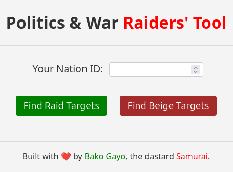

# PnW Raiders' Tool



Tools for finding optimal raiding targets in [Politics and War (PnW) game](https://politicsandwar.com/). Initiated by [Bako Gayo](https://politicsandwar.com/nation/id=684074), the dastard [Samurai](https://politicsandwar.com/alliance/id=10304).

This project provides both Command-Line Interface (CLI) tools and a [web interface](https://whale-app-dke5m.ondigitalocean.app/) for finding targets.

## CLI Tools

### `raid.py` - Raid Target Finder

#### Raid Target Finder Features

- Finds nations within your war score range (configurable in config.py)
- Filters out nations in vacation mode or already in beige
- Respects alliance treaties (DNR - Do Not Raid)
- Prioritizes targets with recent stolen money (1-day and 7-day filters)
- Tracks commerce buildings (markets, banks, malls, stadiums, subways)
- Excludes nations with 3+ active defensive wars
- Compares military strength (ships, missiles, nukes, spies)
- Provides detailed military, economic and infrastructure information
- Outputs results in both human-readable and JSON formats
- Includes direct nation URLs for quick access
- Displays current parameters including:
  - Your nation's military and score
  - Target war score range
  - DNR alliances
  - Military comparison thresholds

#### Raid Target Finder Usage

```bash
python raid.py --nationid <YOUR_NATION_ID> [options]

Options:
  --nationid ID Specify the Nation ID to use for the script (Required)
  --json        Output results in JSON format
  --limit N     Limit number of results (default: 5)
  --max-pages N Maximum number of pages to fetch (default: 10 in config.py)
```

### `beige.py` - Beige Nation Finder

#### Beige Finder Features

- Finds nations that are about to exit beige (1-12 turns remaining)
- Same filtering as `raid.py` but specifically for beige nations
- Prioritizes targets with least beige turns remaining
- Provides same detailed information as `raid.py`
- Includes commerce building and infrastructure details
- Provides direct nation URLs

#### Beige Finder Usage

```bash
python beige.py --nationid <YOUR_NATION_ID> [options]

Options:
  --nationid ID Specify the Nation ID to use for the script (Required)
  --json        Output results in JSON format
  --limit N     Limit number of results (default: 10)
  --max-pages N Maximum number of pages to fetch (default: 10 in config.py)
```

### General CLI Requirements

- Python 3.6+
- `PNW_API_KEY` environment variable set (see `.env.sample`). This key is used to authenticate with the Politics and War API.
- Dependencies listed in `requirements.txt`. Install using `pip install -r requirements.txt`.

### CLI Configuration

Edit `config.py` to adjust:

- `MIN_SCORE_RATIO` - Minimum war score ratio (default 0.75)
- `MAX_SCORE_RATIO` - Maximum war score ratio (default 1.25)
- `MAX_PAGES` - Maximum API pages to fetch for target lists (default 10)
- `MIN_INACTIVE_DAYS` - Minimum inactive days to avoid counters (default 1)
- `IGNORE_DNR` - Bypass alliance treaty checks if True (default False)
- `MAX_SOLDIER_RATIO` - Maximum soldier ratio (default 0.75)
- `MAX_SPIES_RATIO` - Maximum spies ratio (default 5.0)
- `DEBUG` - Enable debug mode (default False)

## Web Interface

The project includes a web interface to easily find raid and beige targets based on a specific Nation ID.

### Web Interface Setup and Running

1. **Install Dependencies:**
    The web interface requires Flask, among other dependencies. Ensure all Python dependencies are installed:

    ```bash
    pip install -r requirements.txt
    ```

2. **Set API Key:**
    The application requires your Politics and War API key to be set as an environment variable named `PNW_API_KEY`. This key is used by the backend to fetch data from the P&W API.
    Example for Linux/macOS:

    ```bash
    export PNW_API_KEY="YOUR_API_KEY_HERE" 
    ```

    Example for Windows (Command Prompt):

    ```bash
    set PNW_API_KEY=YOUR_API_KEY_HERE
    ```

    Alternatively, you can create a `.env` file in the project root (copy from `.env.sample`) and place your API key there. If `python-dotenv` is installed (it's in `requirements.txt`), Flask will automatically load it when run with `flask run` or if `app.py` is modified to load it explicitly for `python app.py`.

3. **Run the Application:**
    Once dependencies are installed and the API key is set (either as an environment variable or in a `.env` file), start the Flask development server:

    ```bash
    flask run --port 8080
    ```

    Alternatively, you can run `python app.py`.

    The application will typically be available at `http://127.0.0.1:8080/`.

### Web Interface Features

- Enter a Nation ID to use as the basis for the search
- Choose to find either "Raid Targets" or "Ending Beige" nations relative to the provided Nation ID's stats
- Results are displayed on a new page, showing key information for each target
- **Rate limiting**: The web interface implements a rate limit of 10 requests per Nation ID per 24-hour period to prevent abuse
- Detailed error messages for invalid input, server errors, or rate limiting
- Production-ready WSGI configuration via `wsgi.py`

## Additional Files

- `manifest.json`: Progressive Web App configuration
- `service-worker.js`: Enables offline functionality
- `wsgi.py`: Production deployment configuration for WSGI servers
- `pnw_api.py`: Core API wrapper for Politics and War API
- `pnwapi.yaml`: GraphQL API schema definitions

## Performance and Scaling

### Current Capacity

- Supports approximately 10-12 concurrent users (based on PnW API rate limits)
- PnW API limits: 60 requests/minute and 150,000 requests/day
- Each user request makes ~3-5 API calls
- Current implementation uses in-memory rate limiting

### Scaling Limitations

- Not optimized for high concurrency (>20 users)
- Rate limiting is process-specific (won't work across multiple workers)
- No request batching or caching implemented

## Contributions Welcome

This is an open-source project and we welcome community contributions, especially in these areas:

- Implementing Redis-based distributed rate limiting
- Adding request batching/queueing for API calls
- Developing client-side caching (localStorage)
- Improving concurrent request handling
- Adding performance monitoring

See our GitHub issues for specific feature requests and bugs to work on.

## Development Notes

- The project follows standard Python packaging practices
- All API calls are made through the centralized `pnw_api.py` wrapper
- Error handling is implemented at multiple levels for robustness
- The web interface can be deployed in production using WSGI servers like Gunicorn
